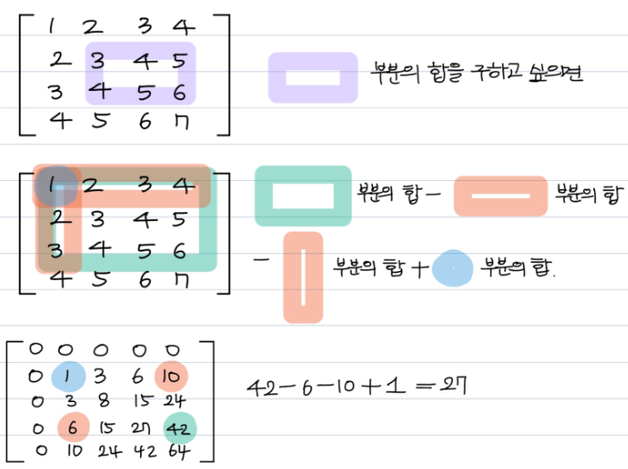

## 📘 week01(25.07.21~25.07.28) - 추지인

### ✅ 어려웠던 문제
- D2 나무높이
- D2 백만 장자 프로젝트
- D2 숫자 배열 회전
- D2 파리퇴치

### ❓ 어려웠던 점
1. 나무높이
- 처음부터 case를 세분화해서 풀려고 했음. 3시간 소요됨
- 풀이의 핵심은 greedy -> 필수와 선택사항으로 나눌 것
2. 파리퇴치
- 처음에는 반복문 돌면서 일일이 원소의 합 구하려고 함
- 누적합 개념을 인지하지 못했음
- 행렬 크기가 커질수록 소요시간이 기하급수적으로 늘어남
- 가령 10 by 10 행렬에, m=3 크기로 파리를 퇴치할 수 있다면 경우의 수 너무 많고 연산 속도 느림


### 💡 배운 포인트
1. 나무높이
- 로직을 복잡하게 짤 필요가 없음. 우선적으로 코드를 작성한 후 덜어내 요소 파악
- 홀수는 1을 반드시 필요로 함. 짝수는 1+1 혹은 2로 표현할 수 있으므로 선택사항
- 반드시 필요한 1의 개수를 구하고, actual = two - (one-1)로 가용한 2의 개수를 구할 것
```
# 핵심 로직

# 만약 actual이 0보다 작거나 같다면, 가용한 2의 수가 더 많다는 뜻.
# 즉, idx는 1의 수 기준으로 idx = 1  + 2* (one -1)

# idx가 지금 1까지 count되었으므로 후에는 2부터
  2 1 2 1 /2 1 2 1 /2 1 2 1/ ... 가 반복될 것
  
# idx(val) 1(2) 3(4) 4(6)/ 5(8) 7(10) 8(12)/ 9(14) 11(16) 12(18)

#1 actual이 6으로 나누어질 때, idx는 4의 배수
two_amount % 6 == 0 -> idx가 4 * (two_amount//6)

#2 actual-4 가 6으로 나누어 떨어지면 idx는 3 + 4 * ((two_amount - 4)//6) 형태

#3 그 외의 경우 1 + 4 * ((two_amount - 2)//6)
```
2. 파리퇴치<br/>
*누적합의 컨셉*

- 누적합 구하는 행렬 먼저 만든 뒤
```
pre_matrix = [[0 for _ in range(n)] for _ in range(n)]
pre_matrix[0][0] = n_list[0][0]

# 0행, 0열 원소들 먼저 합 구하기
for i in range(1,n):
     pre_matrix[0][i] = pre_matrix[0][i-1] + n_list[0][i]
     pre_matrix[i][0] = pre_matrix[i-1][0] + n_list[i][0]

for i in range(1,n):
     for j in range(1, n):
         pre_matrix[i][j] = pre_matrix[i-1][j] + pre_matrix[i][j-1] -pre_matrix[i-1][j-1] + n_list[i][j]
```
- 위 사진과 동일하게 원하는 범위 내의 부분합 구해주면 됨


